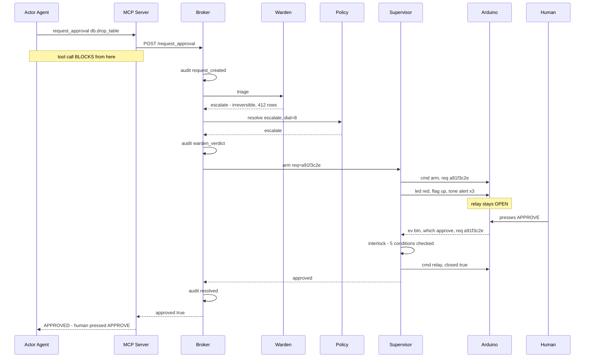
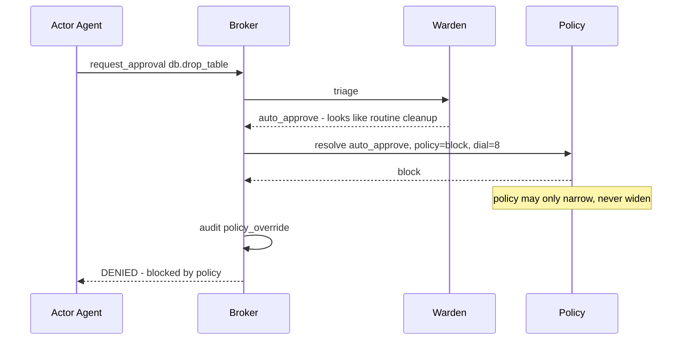
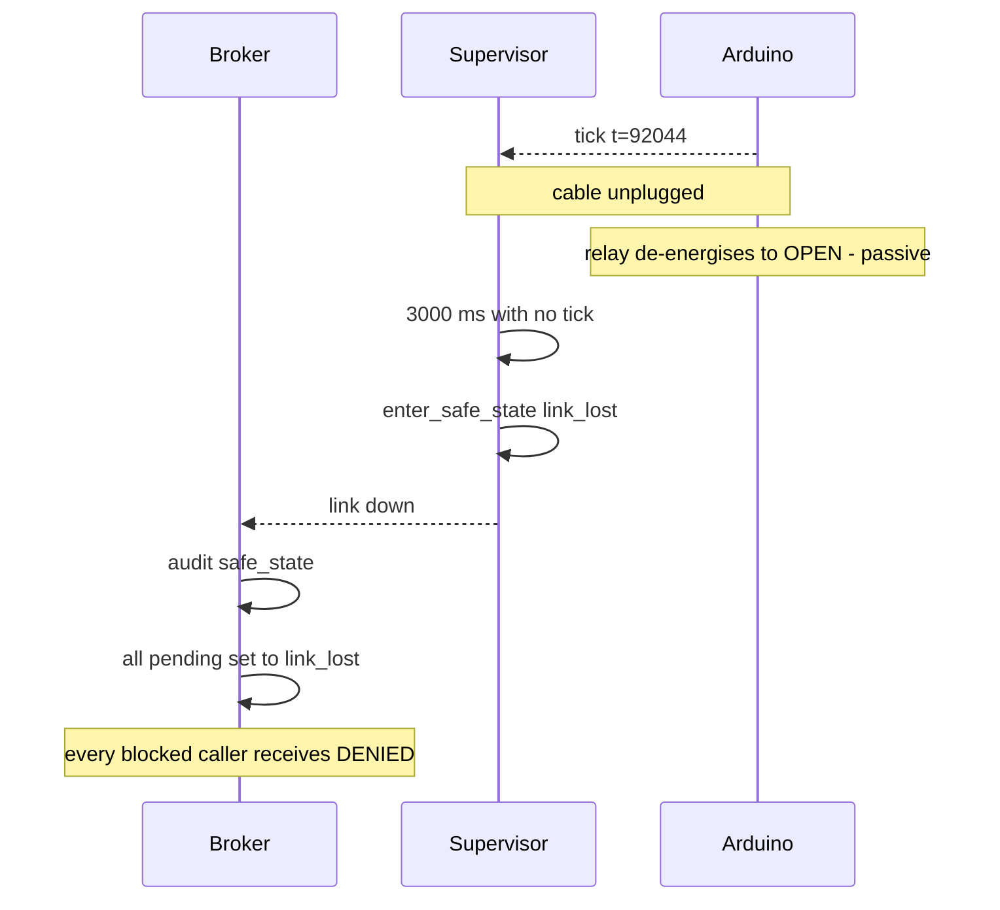

# Airgap — Design Specification

**Version:** 1.0
**Date:** 2026-08-23
**Status:** approved for planning
**Author:** Tomiwa Aluko

---

## 1. About this document

This is the design specification. It states *what* Airgap is, *why* it is shaped
the way it is, and *what it does and does not guarantee*.

It sits above the contract documents in [`spec/`](spec/), which pin down exact
interfaces — wire formats, pin numbers, schemas. Where this document and a
contract disagree, **this document describes intent and the contract describes
truth**; the contract is what code is written against, and a disagreement between
them is a bug in one of them that a human must resolve.

| Layer | Documents | Changes |
|---|---|---|
| Design intent | this file | Rarely. Requires a human decision. |
| Contracts | `spec/00`–`spec/05` | Frozen. Only a human may edit. |
| Work items | `tickets/tickets.yaml` | Freely, as planning refines. |

---

## 2. Problem statement

AI agents are increasingly trusted to take actions that cannot be undone: sending
email, moving money, deploying code, deleting data. The industry's answer is a
"human in the loop" — in practice, a button in a web UI.

That answer has three structural weaknesses:

1. **It lives inside the thing it is checking.** The approval dialog runs in the
   same browser, the same session, the same trust domain as the agent. Anything
   that compromises the agent's environment can plausibly compromise the approval
   flow with it.
2. **It is subject to click fatigue.** An approval that appears in the same place,
   in the same shape, dozens of times a day stops being a decision and becomes a
   reflex. The interface trains the user to defeat it.
3. **It is advisory, never physical.** The gate is an `if` statement. Nothing about
   the world changes while approval is pending.

There is currently no widely available **out-of-band, physically grounded consent
channel** for agent actions.

---

## 3. Goals and non-goals

### Goals

- **G1** — Provide an approval channel that is *out-of-band*: separate hardware,
  separate input device, not reachable by the agent or by code running in the
  agent's environment.
- **G2** — Make the pending state *physically apparent*. A human in the room
  should know an agent is blocked without looking at a screen.
- **G3** — Make approval *effortful enough to be a decision*. A physical button
  press in the physical world resists reflex in a way a dialog does not.
- **G4** — Where the action's power path can be interrupted, make the block
  *physically enforced* rather than advisory.
- **G5** — Produce a tamper-evident record of every request, verdict, and reason.
- **G6** — Reduce approval volume without reducing safety, via an LLM triage layer
  that can only ever *narrow* authority, never widen it.
- **G7** — Integrate with no bespoke work: any MCP client gets the gate for free.

### Non-goals

- **N1** — Airgap is **not a sandbox.** It does not confine an agent. See §4.4.
- **N2** — Not a policy language. Policies are a small table, not a DSL.
- **N3** — Not multi-tenant. One device, one human, one trust domain.
- **N4** — Not a replacement for least-privilege credentials. It complements them.
- **N5** — Not a general IoT control system. The device does one job.

---

## 4. Threat model

This is a security product, so this section is the most important one, and the
subsection that matters most is the one listing what Airgap **does not** defend
against.

### 4.1 Trust zones

| Zone | Contains | Trusted for |
|---|---|---|
| **Z0** | The human operator | Everything. Root of trust. |
| **Z1** | Arduino, buttons, dial, relay | *Input authenticity* — a button event means a finger pressed a button. **Not** display integrity: it renders whatever the host sends. |
| **Z2** | Broker, Supervisor, Serial Bridge, DB | Correct enforcement, **while uncompromised**. |
| **Z3** | Warden LLM | Nothing. Advisory only; output is validated and can only narrow. |
| **Z4** | Actor agent | Nothing. Assumed compromisable. |
| **Z5** | Content the actor reads — web pages, docs, tool output | Actively hostile. |

### 4.2 Threats defended against

| # | Threat | Defence |
|---|---|---|
| **T1** | Agent genuinely misjudges: it believes a destructive action is correct | Human sees the action and its blast radius, and can deny |
| **T2** | Prompt injection from Z5 drives the agent to attempt an unauthorised action | Injected text can make the agent *ask*; it cannot make a human *press*. Warden additionally screens for injection signatures |
| **T3** | Approval UI spoofed or auto-clicked by code in the agent's environment | Approval input is on separate hardware with no software path to it |
| **T4** | Runaway retry loop hammering the same action | Supervisor rate limits; `ALWAYS-DENY` button blocks the whole class |
| **T5** | Agent argues the Warden into granting broader authority | Deterministic policy runs *after* the Warden and can only narrow (§6, D6) |
| **T6** | Decision record altered after the fact to hide what happened | Hash-chained append-only audit log; DB-level UPDATE/DELETE rejection |
| **T7** | Broker crashes or the cable is pulled while a request is pending | Fail-safe: relay de-energises to open; pending requests resolve `link_lost` |
| **T8** | Agent escalates its own autonomy level | The dial is a potentiometer. It is readable and not writable. There is no code path to change it |

### 4.3 Threats explicitly NOT defended against

Stating these plainly is what separates this from security theatre.

| # | Threat | Why not | Residual mitigation |
|---|---|---|---|
| **N-T1** | **Agent bypasses Airgap entirely** by not calling `request_approval` | Airgap gates what is *routed through it*. It cannot gate what it never sees | Least-privilege credentials; only give the agent tool access that routes through the gate |
| **N-T2** | **Host compromise.** Attacker controls the broker, so the LCD shows "send $5" while the real action is "send $5000" | The device renders what the host sends. Display integrity depends on Z2 | None that is honest. A second display path independent of Z2 would be required. Out of scope for v1 |
| **N-T3** | Malicious or coerced human presses approve | Z0 is the root of trust by definition | Multi-party approval (two devices, two humans) is a stretch feature |
| **N-T4** | Someone else in the room presses the button | The device cannot authenticate the finger | Physical placement; multi-party approval |
| **N-T5** | Malicious firmware flashed to the device | Supply chain is out of scope | Flash it yourself; verify the sketch is the one in `firmware/` |
| **N-T6** | The action is approved and *is* harmful — the human was simply wrong | Airgap conveys the decision, it does not make it | Warden surfaces blast radius; history shows patterns |

### 4.4 The distinction that matters: consent channel vs enforcement boundary

Airgap operates in **two different modes**, and conflating them would be
dishonest about what it provides.

| Mode | When it applies | Guarantee | Survives host compromise? |
|---|---|---|---|
| **Enforcement boundary** | The relay is physically in the power or signal path of the thing being controlled — a lamp, a pump, a motor, a machine's mains | **Strong.** The action is physically impossible while the relay is open | Partially — the relay opens on link loss regardless |
| **Consent channel** | The action is purely digital and reachable by other paths — `DROP TABLE`, `send_email`, an API call | **Moderate.** Guarantees the agent *asked*, and gives a human a genuine out-of-band veto. Does **not** make the action impossible | No |

**Most software actions are consent channel.** The relay demo is enforcement.
Claiming enforcement for `DROP TABLE` would be false: an agent with database
credentials can reach the database whether or not a servo is holding a contact
open in another room.

This is not a weakness to hide — it is the correct scope. A consent channel that
is genuinely out-of-band is a real and currently missing security control. The
relay exists to demonstrate that the *same* mechanism becomes hard enforcement
whenever the action's power path can be interrupted.

---

## 5. Users and use cases

**Primary user:** an engineer running agentic tooling on their own machine with
credentials that can do real damage. One human, one desk, one device.

| # | Use case | Expected outcome |
|---|---|---|
| U1 | Agent proposes a destructive DB migration | Escalate. Human denies. Agent proposes a soft-delete instead |
| U2 | Agent wants to read a file, 40th time today | Warden auto-approves. Device stays dark. No human interruption |
| U3 | Agent processes a doc containing an injection payload | Warden flags injection; request escalates with a warning; human denies |
| U4 | Human is away from the desk when a request arrives | Request expires after 30 min, resolves denied, relay stays open |
| U5 | Human wants a strict session before a demo | Turn the dial to 10. Everything escalates. Agent cannot change this |
| U6 | Reviewing what happened last week | Dashboard audit trail with chain verification per row |

---

## 6. Design decisions

Each records the alternative that was considered and why it lost.

### D1 — `request_approval` blocks; it does not return a handle

**Chosen:** the MCP tool call hangs until a verdict exists.
**Alternative:** return `{request_id}` immediately, agent polls `check_approval`.
**Why:** the blocking shape makes the guarantee trivial to state ("the call cannot
return without a verdict") and makes the demo legible — the agent visibly stalls.
Polling invites an agent to give up and proceed. **Verified before committing:** a
real MCP client survived a 150 s block on both stdio and streamable-http
transports with default settings ([spike 01](../spikes/01-blocking-tool-call/FINDINGS.md)).
The polling design remains documented as a fallback but is not built.

### D2 — Dedicated hardware, not a phone notification

**Chosen:** a physical device on the desk.
**Alternative:** push notification to the user's phone.
**Why:** a phone notification is still software, still subject to spoofing and
fatigue, and gives no ambient signal to anyone else in the room (G2). The physical
flag, light and sound do. Remote push is a stretch feature *in addition to*, never
instead of, the device.

### D3 — Two digital LED pins, not a PWM RGB LED

**Chosen:** `LED_RED` and `LED_GREEN`; amber is both on.
**Alternative:** a PWM RGB LED with arbitrary colours.
**Why:** on an UNO, Timer0 is `millis()`, Timer1 is `Servo`, Timer2 is `tone()`.
Every hardware PWM pin is claimed. A PWM RGB LED would glitch whenever the buzzer
sounds. The protocol only defines three states, so PWM buys nothing and costs
correctness.

### D4 — The device reports; the host commands the relay

**Chosen:** firmware emits button events; the Supervisor decides and sends
`relay`.
**Alternative:** firmware closes its own relay on an approve press.
**Why:** it keeps the five-condition interlock in exactly one place, in testable
Python, rather than duplicated across two languages where the copies can drift.
The cost is one extra round trip — irrelevant at human timescales.

### D5 — Exactly one request armed at a time

**Chosen:** strict serialisation; others queue FIFO with callers still blocked.
**Alternative:** multiple concurrent pending requests.
**Why:** there is one flag and one set of buttons. A human pressing APPROVE with
two requests pending cannot indicate *which* they meant. Any design that allows
ambiguity there is unsafe, and no UI affordance on a 16×2 LCD fixes it.

### D6 — LLM triage first, deterministic policy second

**Chosen:** Warden proposes; policy engine resolves and may only narrow.
**Alternative (a):** policy only — no LLM. **Alternative (b):** LLM only.
**Why:** (a) cannot reason about novel actions or blast radius; (b) can be
argued with. Running deterministic rules *after* the model means a jailbroken
Warden cannot widen its own authority — the worst it can do is escalate something
that could have been auto-approved, which is a safe failure. This asymmetry is
asserted as a property test, not just a code path (ticket AIR-11).

### D7 — The autonomy dial is a potentiometer

**Chosen:** a physical analog control, read-only to software.
**Alternative:** a setting in the dashboard.
**Why:** a software setting is writable by whatever compromises the software. A
potentiometer is writable only by a hand. It is the cheapest possible defence
against privilege self-escalation (T8) and it is legible to anyone watching.

### D8 — Fail-safe is passive, not active

**Chosen:** relay is active-HIGH; de-energised means open means denied.
**Alternative:** software detects failure and commands the relay open.
**Why:** active fail-safe requires the failing component to work correctly during
its own failure. Passive fail-safe means an unplugged cable, a dead host, or a
crashed process all produce the safe state with no code running at all. Bring-up
item 6 (AIR-5) exists solely to verify this on real hardware.

### D9 — Hash-chained audit log

**Chosen:** append-only with a sha256 chain, enforced by a DB trigger.
**Alternative:** ordinary application log.
**Why:** the log's purpose is to be trustworthy *after* an incident, when the
question is whether someone edited it. A chain makes tampering detectable and
localisable. The DB-level trigger means the guarantee does not depend on
application code being correct.

### D10 — One MCP tool, not several

**Chosen:** `request_approval` only.
**Alternative:** `request_approval`, `check_status`, `cancel`, `list_pending`.
**Why:** every additional tool is surface an actor agent can use to reason its way
around the gate. One tool, one shape, no alternate paths.

---

## 7. End-to-end flows

### 7.1 Escalation to a human, approved



### 7.2 Warden auto-approves, policy overrides

The safety-critical path. The Warden is wrong or has been argued with; the
deterministic layer catches it. The device is never armed and the human is never
interrupted — the action is simply blocked.



### 7.3 Link loss mid-request



---

## 8. Failure mode analysis

| # | Failure | Detected by | Effect | Mitigation | Residual risk |
|---|---|---|---|---|---|
| F1 | USB cable unplugged | Tick starvation, 3 s | Relay opens passively | D8 fail-safe | 3 s window where a closed relay stays closed |
| F2 | Broker process crash | Connection drop | Pending calls error out | Startup marks stale rows `link_lost` | Caller sees a transport error, not a clean DENIED |
| F3 | Arduino resets mid-request | `boot` event | Device comes up disarmed, relay open | Host must re-`arm`; verdict unaffected | Human may see the flag drop and re-raise |
| F4 | Serial garbage / EMI | Unparseable frames counted | Frames dropped | 3 consecutive → safe state | A corrupted `req` field looks like a mismatch → correctly ignored |
| F5 | Button bounce | — | Duplicate events | 25 ms debounce + replay guard in interlock | None significant |
| F6 | Warden API unreachable | Timeout | No triage available | Fall back to `escalate`, never `auto_approve` | More human interruptions during an outage |
| F7 | Warden returns malformed output | Parse failure | — | Fall back to `escalate` | As F6 |
| F8 | Postgres unavailable | Connection error | Cannot audit | **Refuse the request** — deny by default | Availability cost, accepted: no audit means no approval |
| F9 | Two requests race to arm | Interlock rejects second | Second stays queued | D5 serialisation | Queue depth grows if the human is away |
| F10 | Relay welded shut (hardware) | Not detectable in software | Enforcement silently absent | Bring-up test; periodic manual check | **Real and unmitigated.** A relay that fails closed defeats G4 |
| F11 | Clock skew between device and host | — | `t` fields misaligned | Host timestamps authoritatively; device `t` is diagnostic only | None |

F10 deserves emphasis: mechanical relays can fail welded. Airgap cannot detect
this in software. Anyone relying on the enforcement-boundary mode (§4.4) for
something genuinely dangerous should use a relay with a monitored contact, which
is out of scope for v1 and noted here so the limitation is on the record.

---

## 9. Physical interaction design

What the human perceives, and what it means. This is a design decision set the
contracts do not cover.

| System state | LED | Flag | Tone | LCD |
|---|---|---|---|---|
| Idle, no pending request | off | down | — | `AIRGAP READY` / dial level |
| Auto-approved (no human needed) | green, 1 s | down | `ok` ×1 | action, briefly |
| Pending, low risk | amber | up | `alert` ×1 | action / blast radius |
| Pending, high risk | red | up | `alert` ×3 | action / blast radius |
| Approved by human | green, 2 s | down | `ok` ×2 | `APPROVED` |
| Denied | red, 2 s | down | `deny` ×2 | `DENIED` |
| Safe state / link lost | red, steady | up | `deny` ×1 | `LINK LOST` |

Principles:

- **The flag is the primary signal**, not the LED. It is mechanical, visible from
  across a room, visible in peripheral vision, and readable in a photograph. The
  LED is secondary and the LCD is detail.
- **Sound escalates with severity, and never repeats more than once.** A device
  that keeps beeping gets muted, and a muted safety device is worse than none.
- **Green is never shown while anything is pending.** Ambiguity between "approved"
  and "waiting" is the one confusion that could cause a wrong press.
- **The dial level is always visible when idle**, so the operator knows their
  current posture without asking.

---

## 10. Non-functional requirements

| # | Requirement | Target | Why |
|---|---|---|---|
| NF1 | Request → device alert | < 500 ms p95 | The human should perceive it as immediate |
| NF2 | Button press → tool call returns | < 300 ms p95 | Physical actions must feel connected to their effect |
| NF3 | Warden triage | < 3 s p95 | Longer and auto-approval feels slower than just asking |
| NF4 | Link-loss detection | < 3 s | Bounded by the 1 Hz tick + 3 missed |
| NF5 | Firmware main loop | < 5 ms always | Button responsiveness; no `delay()` anywhere |
| NF6 | Request expiry | 30 min, configurable | Bounds an unattended request |
| NF7 | Concurrent armed requests | exactly 1 | D5 |
| NF8 | Audit durability | Every decision written before it is acted on | A decision that isn't recorded didn't happen |
| NF9 | Restart behaviour | No approval survives a broker restart | Restart is not a trust event |
| NF10 | Offline capability | Device functions with no network; only Warden needs it | Loss of internet degrades to all-escalate, not to open |

---

## 11. Deployment topology

**v1 is single-host, local.** Broker, Supervisor, bridge, MCP server, dashboard
and Postgres all run on the operator's machine. The Arduino is on USB. The only
outbound network call is to the Anthropic API for the Warden.

```
[operator's machine]
  ├── mcp_server        stdio (to local agents) or 127.0.0.1 streamable-http
  ├── broker            127.0.0.1 only, never bound to 0.0.0.0
  ├── supervisor        in-process with the broker, owns the serial port
  ├── postgres          localhost
  ├── web dashboard     127.0.0.1
  └── USB ──────────────► Arduino UNO ──► relay ──► controlled load
```

**Explicitly not v1:** hosting the broker remotely. That would put the network
between the Supervisor and the device, adding a failure mode (network partition
looks like link loss) and an attack surface, for no benefit at this scale. If it
is ever done, re-run [spike 01](../spikes/01-blocking-tool-call/FINDINGS.md)
against the real deployment first — a reverse proxy will impose its own idle
timeout, and nginx defaults to 60 s.

---

## 12. Risks and open questions

| # | Risk | Impact | Plan |
|---|---|---|---|
| R1 | Blocking calls not verified past 150 s | Long unattended approvals may fail | Re-run the spike at 30 min before relying on it. Expiry bounds exposure |
| R2 | Warden auto-approval erodes the value of the gate | Fatigue returns, in a new form | Weekly digest of what was auto-approved; start with auto-approve disabled |
| R3 | Relay fails welded (F10) | Enforcement silently absent | Documented; monitored-contact relay if it ever matters |
| R4 | LCD text is host-controlled (N-T2) | Human approves a misrepresented action | Accepted for v1 and stated plainly. Independent display path is future work |
| R5 | Only the Python MCP SDK was tested | Another client may time out | Fallback design documented, not built |
| R6 | Single armed request may bottleneck | Queue grows while human is away | Expiry drains it; dashboard alerts above depth 5 |

**Open questions for planning:**

1. Should `ALWAYS-DENY` persist across restarts, or only for the session? Leaning
   persist, since a class you've rejected is a durable judgment.
2. Should auto-approve ship enabled or disabled by default? Leaning disabled — the
   gate should prove itself before it starts skipping.
3. Does the dial gate *classes* of action or a global strictness scalar? Currently
   specced as a scalar compared against `policies.min_dial`. Simpler, possibly
   too blunt.

---

## 13. Success criteria

**Functional** — all of `docs/tickets` AIR-14's end-to-end scenarios pass:
approve, deny, policy override, link loss, mismatched request id, and the audit
chain verifying after each.

**Security** — for each defended threat T1–T8 there is a test that demonstrates
the defence, and each NOT-defended threat N-T1–N-T6 is stated in the README so
nobody deploys this believing it is a sandbox.

**Demonstration** — a cold observer watching for 60 seconds, with no explanation,
can answer: what did the agent want to do, why was it stopped, and what made it
proceed. If that fails, the physical interaction design (§9) is wrong regardless
of whether the code is correct.

**Engineering** — `uv run pytest`, `ruff`, and `mypy --strict` clean; every
safety-critical module has its failure modes tested independently; no PR modified
a frozen contract.

---

## 14. Downstream documents

| Document | Role |
|---|---|
| [`spec/00-overview.md`](spec/00-overview.md) | Component boundaries, invariants, repo layout |
| [`spec/01-serial-protocol.md`](spec/01-serial-protocol.md) | Wire contract |
| [`spec/02-supervisor.md`](spec/02-supervisor.md) | Safety rules, the five-condition interlock |
| [`spec/03-broker-api.md`](spec/03-broker-api.md) | HTTP and MCP contract |
| [`spec/04-firmware.md`](spec/04-firmware.md) | Pin map, timer allocation, state machine |
| [`spec/05-data-model.md`](spec/05-data-model.md) | Schema, audit chain, policy resolution |
| [`tickets/tickets.yaml`](tickets/tickets.yaml) | 15-ticket implementation DAG |
| [`ORCHESTRATOR_PROMPT.md`](ORCHESTRATOR_PROMPT.md) | Codex orchestrator instructions |
