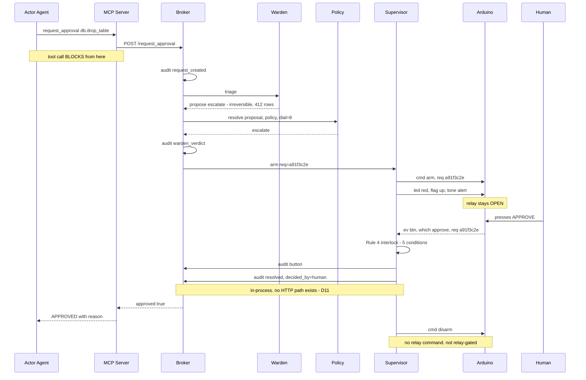
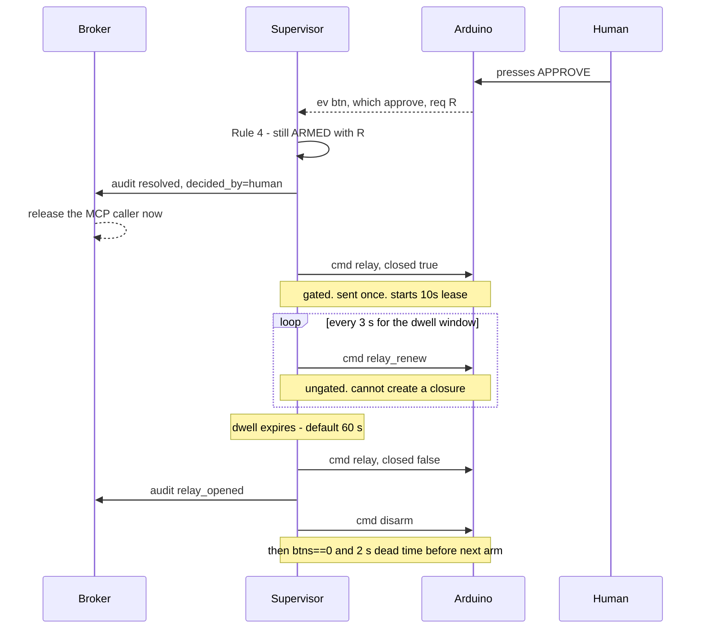
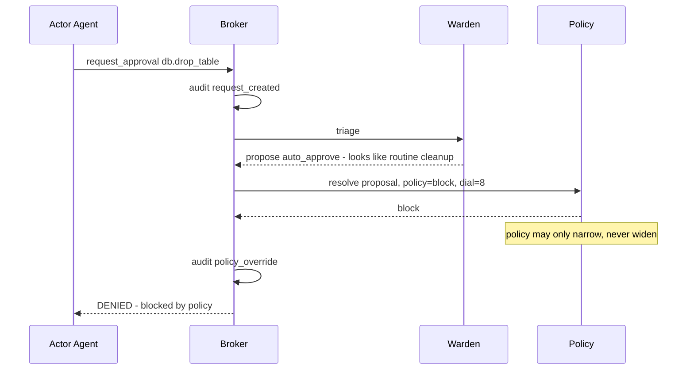
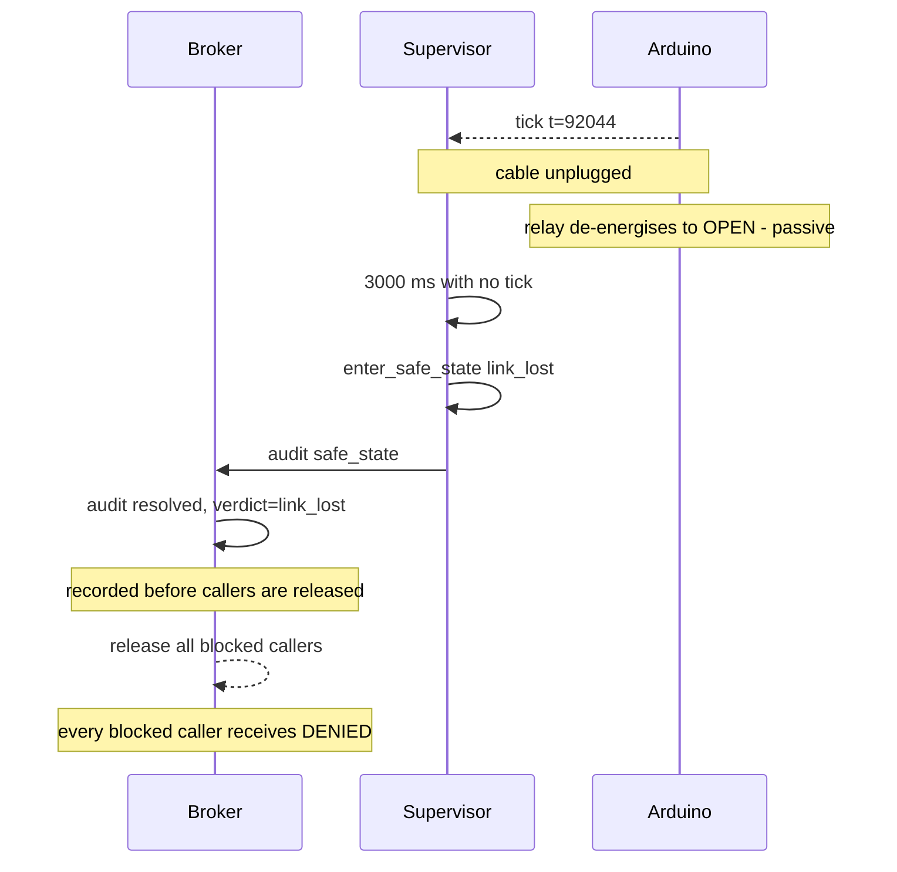

# Airgap — Design Specification

**Version:** 1.4
**Date:** 2026-08-23
**Status:** revised after design reviews 01 and 02 and plan reviews 01 and 02 —
see [`reviews/`](reviews/)
**Author:** Tomiwa Aluko

---

## 1. About this document

This is the design specification. It states *what* Airgap is, *why* it is shaped
the way it is, and *what it does and does not guarantee*.

It sits above the contract documents in [`spec/`](spec/), which pin down exact
interfaces — wire formats, pin numbers, schemas. Where this document and a
contract disagree, **this document describes intent and the contract describes
truth**; the contract is what code is written against, and a disagreement between
them is a bug in one of them that a human must resolve.

| Layer | Documents | Changes |
|---|---|---|
| Design intent | this file | Rarely. Requires a human decision. |
| Contracts | `spec/00`–`spec/05` | Frozen. Only a human may edit. |
| Work items | `tickets/tickets.yaml` | Freely, as planning refines. |

**v1.1** resolved review 01: v1.0 sold a stronger thesis in its goals and threat
table than §4.4 supported, and described the human approval path three different
ways across four documents.

**v1.2** resolves review 02, which found that the lease v1.1 introduced *fought
the interlock it was bolted onto*. `relay(closed=true)` is Rule-4-gated, so
reusing it as a heartbeat made Rule 4, 4a, 4b and NF11 mutually unsatisfiable —
as written, the contact could never close after an approval. The relay now has a
separate ungated keepalive (`relay_renew`), an explicit dwell window with a
defined end, and `relay_gated` is a column rather than an inference. If you read
v1.1, re-read D8, D11, D12, §7.1 and §4.4's corollary.

---

## 2. Problem statement

AI agents are increasingly trusted to take actions that cannot be undone: sending
email, moving money, deploying code, deleting data. The industry's answer is a
"human in the loop" — in practice, a button in a web UI.

That answer has three structural weaknesses:

1. **It lives inside the thing it is checking.** The approval dialog runs in the
   same browser, the same session, the same trust domain as the agent. Anything
   that compromises the agent's environment can plausibly compromise the approval
   flow with it.
2. **It is subject to click fatigue.** An approval that appears in the same place,
   in the same shape, dozens of times a day stops being a decision and becomes a
   reflex. The interface trains the user to defeat it.
3. **It is advisory, never physical.** The gate is an `if` statement. Nothing about
   the world changes while approval is pending.

---

## 3. Goals and non-goals

### Goals

- **G1** — Make the **approval input** out-of-band: a physical button on separate
  hardware, with no software path by which an agent can press it. *This is a claim
  about the buttons, not about the broker.* The broker is ordinary software on the
  same host as the agent and is scoped in §4.
- **G2** — Make the pending state *physically apparent*. A human in the room
  should know an agent is blocked without looking at a screen.
- **G3** — Make approval *effortful enough to be a decision*. A physical button
  press resists reflex in a way a dialog does not.
- **G4** — Where the action's power path can be interrupted, make the block
  *physically enforced* rather than advisory.
- **G5** — Produce a tamper-**evident** record of every request, verdict, and
  reason. Evident, not tamper-proof; see D9.
- **G6** — Reduce approval volume without exceeding a fixed authority envelope:
  an LLM triage layer proposes, and a deterministic policy layer bounds what that
  proposal can become. **The one-way valve is the policy layer, not the LLM.**
- **G7** — Integrate with no bespoke work: an MCP client gets the gate with no
  Airgap-specific code. Verified against the Python SDK only (R5); "any client"
  is the intent, not yet a tested claim.

### Non-goals

- **N1** — Airgap is **not a sandbox.** It does not confine an agent. See §4.4.
- **N2** — Not a policy language. Policies are a small table, not a DSL.
- **N3** — Not multi-tenant. One device, one human, one trust domain.
- **N4** — Not a replacement for least-privilege credentials. It complements them.
- **N5** — Not a general IoT control system. The device does one job.

---

## 4. Threat model

This is a security product, so this section is the most important one, and the
subsection that matters most is the one listing what Airgap **does not** defend
against.

### 4.1 Trust zones

| Zone | Contains | Trusted for |
|---|---|---|
| **Z0** | The human operator | Everything. Root of trust. |
| **Z1** | Arduino, buttons, dial, relay | *Input authenticity* — a button event means a finger pressed a button. **Not** display integrity: it renders whatever the host sends. |
| **Z2** | Broker, Supervisor, Serial Bridge, Postgres, dashboard | Correct enforcement, **while uncompromised**. Everything in Z2 fails together. |
| **Z3** | Warden LLM | Nothing. Its output is a *proposal* bounded by the policy layer. Assume it is fully compromised and the bound still holds. |
| **Z4** | Actor agent | Nothing. Assumed compromisable. |
| **Z5** | Content the actor reads — web pages, docs, tool output | Actively hostile. |

The critical property of this table: **Z2 is one zone, not several.** The broker,
the Supervisor, the database, the MCP server and the dashboard are separate
*processes* but share **one host and one operator account**, which is the boundary
that matters. There is no defence in depth *within* Z2, and claiming otherwise was
the main error in v1.0. (Process separation still buys something — it is why token
scopes in `spec/03` are worth having against a *partially* compromised Z2 — but do
not mistake it for a trust boundary.)

### 4.2 Threats defended against

| # | Threat | Defence | Holds when |
|---|---|---|---|
| **T1** | Agent genuinely misjudges: it believes a destructive action is correct | Human sees the action and its blast radius and can deny | Z2 intact. The rendering the human reads comes *from* Z2 — see N-T2 and the truncation note below |
| **T2** | Prompt injection from Z5 drives the agent to attempt an unauthorised action | Injected text can make the agent *ask*; it cannot make a human *press* | Always, for escalated requests. **Not** for auto-approved ones — see N-T7 |
| **T3** | Approval **input** spoofed or auto-clicked by code in the agent's environment | The buttons are on separate hardware with no software path. The verdict `decided_by=human` is settable only by the Supervisor after the Rule 4 interlock passes, and is unreachable over HTTP (D11) | Z2 intact |
| **T4** | Runaway retry loop hammering the same action | Broker-side rate limit and dedup on `/request_approval` (not the serial rate limits, which throttle device frames); `NEVER` button blocks the class persistently | Always |
| **T5** | Agent argues the Warden into granting broader authority | Deterministic policy resolves after the Warden and may only narrow (D6) | Always — this is the one guarantee that survives a fully compromised Z3 |
| **T6** | Decision record edited by application code, an ORM bug, or a non-superuser | Hash chain plus DB-level UPDATE/DELETE rejection | **Not** against a Z2 superuser, who can drop the trigger and recompute the chain. See D9 |
| **T7** | USB cable pulled while a request is pending | Bus-powered device loses power, relay coil de-energises, contact opens with no code running | Always, for cable pull specifically |
| **T8** | Broker process killed while the relay is closed | Firmware relay **lease**: the contact opens if the host does not renew within 10 s (D8) | Always |
| **T9** | Agent escalates its own autonomy level | The dial is a potentiometer. Readable, not writable. No code path exists to change it | Always |

**On T1, truncation, and the cost of the full-fidelity cross-reference.** The LCD
is 16×2. `users_production` and `users_prod_bak` do not fit and do not
disambiguate when truncated. So the LCD is an **alert**, not the authoritative
description: a `high`-risk request shows a short code matching a row in a
**full-fidelity reader**, and the human reads the real action there (§9).

A full-fidelity reader is a role, not a product. Two implementations satisfy it —
the `airgap watch` terminal reader and the web dashboard — and either is
sufficient on its own. The requirement is the *fidelity*, not the surface.

That is a real trade and review 02 named it (finding I7). Being precise about what
it costs, because the finding's framing slightly overstates it:

- It is **not** a new *trust* dependency. The LCD was already Z2-rendered — N-T2
  has always said the host can lie about what you are approving. Moving the
  authoritative text to a reader does not add a zone.
- It **is** a new *attack surface* inside that zone, and **how much** depends on
  which reader. A browser, a template, and a rendering path are more attackable
  than a 32-character serial write: XSS, or a stale row whose short code happens
  to match, is a T1 bypass the LCD-only design did not have. A terminal reader
  has neither a template nor a script engine, so it sits far closer to the serial
  write than to the browser. **Prefer the terminal reader where the deployment
  allows it**; the exposure this bullet describes is then largely avoided rather
  than relocated. Its own equivalent risk is ANSI-escape injection through
  attacker-controlled strings, which is why that is an explicit acceptance
  criterion on the reader rather than an afterthought.
- The short code is therefore generated per-arm and includes a nonce, so a stale
  row in either reader cannot match a live request. That closes the stale-row
  case; it does not close XSS in the browser reader, which is bounded only by
  N-T2.

§2 rejected in-band *approval*. The press is still physical, so that still holds.
What has moved in-band is the *description*, which was never out-of-band to begin
with.

### 4.3 Threats explicitly NOT defended against

Stating these plainly is what separates this from security theatre.

| # | Threat | Why not | Residual mitigation |
|---|---|---|---|
| **N-T1** | **Agent bypasses Airgap entirely** by not calling `request_approval` | Airgap gates what is *routed through it*. It cannot gate what it never sees | Least-privilege credentials; only grant tool access that routes through the gate |
| **N-T2** | **Z2 compromise.** The attacker controls the broker, the Supervisor, the database and the dashboard together | Everything in Z2 shares a host. A compromised Z2 can render a false action on the LCD, synthesise `btn` frames, renew the relay lease, rewrite the policy table, and recompute the audit chain | **None that is honest.** Every guarantee in §4.2 marked "Z2 intact" is void. This is the dominant residual risk |
| **N-T3** | Malicious or coerced human presses approve | Z0 is the root of trust by definition | Multi-party approval is a stretch feature |
| **N-T4** | Someone else in the room presses the button | The device cannot authenticate the finger | Physical placement; multi-party approval |
| **N-T5** | Malicious firmware flashed to the device | Supply chain is out of scope | Flash it yourself; verify against `firmware/` |
| **N-T6** | The action is approved and *is* harmful — the human was simply wrong | Airgap conveys the decision, it does not make it | Warden surfaces blast radius; history shows patterns |
| **N-T7** | **An auto-approved action is never seen by a human at all** | That is what auto-approval *means*. T2's "it cannot make a human press" does not apply when no press occurs | Auto-approval is bounded by the policy envelope, is off by default (§12 Q2), and can never close the relay (D12) |
| **N-T8** | **The policy table is software-writable.** Anything holding the `ui` token — the dashboard — can widen `db.drop_*` to `auto_approve` | The policy table lives in Z2 and inherits Z2's trust. The dial resists self-escalation; the policy table does not | Policy edits are audited, and the write capability is confined to the one scope that needs it: `ui`, not `ui_ro`. A genuine fix requires the dial to gate widening edits — noted in §12 R7 |

### 4.4 The distinction that matters: consent channel vs enforcement boundary

Airgap operates in **two different modes**, and conflating them would be
dishonest about what it provides.

| Mode | When it applies | Guarantee | Survives Z2 compromise? |
|---|---|---|---|
| **Enforcement boundary** | The relay is physically in the power or signal path of the thing being controlled — a lamp, pump, motor, machine mains | **Strong.** The action is physically impossible while the relay is open | **No.** A compromised Z2 keeps the link up, synthesises a `btn` frame, and closes the contact. What survives Z2 *failure* (crash, unplug) is not the same as surviving Z2 *compromise* |
| **Consent channel** | The action is purely digital and reachable by other paths — `DROP TABLE`, `send_email`, an API call | **Moderate.** Guarantees the agent *asked*, and gives a human a genuine out-of-band veto. Does **not** make the action impossible | No |

**Most software actions are consent channel.** The relay demo is enforcement.
Claiming enforcement for `DROP TABLE` would be false: an agent with database
credentials reaches the database whether or not a servo is holding a contact open
in another room.

This is not a weakness to hide — it is the correct scope. A consent channel that
is genuinely out-of-band is a real and currently missing security control.

**Corollary — auto-approval and enforcement mode are incompatible.** Rule 4
requires a verified button press before the relay may close, and an auto-approved
request never produces one.

v1.1 stopped there and inferred "therefore relay-gated actions always escalate."
**That inference is invalid** (review 02 finding I3): a missing interlock branch
stops the *contact* closing, it does not change the *verdict*. An auto-approved
lamp would have returned `APPROVED` to the agent while the lamp stayed dark — a
silent enforcement failure, which is the worst kind.

So the rule lives in the resolver instead, as an explicit narrowing step: a policy
row with `relay_gated = true` forces `auto_approve → escalate` before resolution
completes. `relay_gated` is a column on `policies`, not a convention or a
hardcoded list, because implementers given a convention will pick one of three
incompatible readings of it (D12).

---

## 5. Users and use cases

**Primary user:** an engineer running agentic tooling on their own machine with
credentials that can do real damage. One human, one desk, one device.

| # | Use case | Expected outcome |
|---|---|---|
| U1 | Agent proposes a destructive DB migration | Escalate. Human denies. Agent proposes a soft-delete instead. **Consent channel — no relay involved** |
| U1b | Agent wants to energise a bench power supply (`relay_gated`) | Escalate — always, `auto_approve` is forced to `escalate` for gated rows. Human presses APPROVE, contact closes for the 60 s dwell, then opens |
| U2 | Agent wants to read a file, 40th time today | Warden proposes auto-approve, policy permits. LCD notes it; **no LED, no flag, no tone.** No human interruption |
| U3 | Agent processes a doc containing an injection payload | Injection detection is weak (N-T7). The reliable defence is that `file.delete` is not in the auto-approve envelope, so it escalates and the human denies |
| U4 | Human is away from the desk when a request arrives | Request resolves `expired` after 30 min. Relay stays open |
| U5 | Human wants a strict session before a demo | Turn the dial to 10. Everything escalates. Agent cannot change this |
| U6 | Reviewing what happened last week | Dashboard audit trail with chain verification per row |

---

## 6. Design decisions

Each records the alternative that was considered and why it lost.

### D1 — `request_approval` blocks; it does not return a handle

**Chosen:** the MCP tool call hangs until a verdict exists.
**Alternative:** return `{request_id}` immediately, agent polls `check_approval`.
**Why:** the blocking shape makes the guarantee trivial to state and makes the
demo legible — the agent visibly stalls. Polling invites an agent to give up and
proceed. **Verified before committing:** a real MCP client survived a 150 s block
on both stdio and streamable-http transports with default settings
([spike 01](../spikes/01-blocking-tool-call/FINDINGS.md)).

### D2 — Dedicated hardware, not a phone notification

**Chosen:** a physical device on the desk.
**Alternative:** push notification to the user's phone.
**Why:** a phone notification is still software, still subject to spoofing and
fatigue, and gives no ambient signal to anyone else in the room (G2).

### D3 — Two digital LED pins, not a PWM RGB LED

**Chosen:** `LED_RED` and `LED_GREEN`; amber is both on; off is both low.
**Alternative:** a PWM RGB LED with arbitrary colours.
**Why:** on an UNO, Timer0 is `millis()`, Timer1 is `Servo`, Timer2 is `tone()`.
Every hardware PWM pin is claimed, so a PWM RGB LED would glitch whenever the
buzzer sounds. The protocol defines four LED states (`off`, `green`, `amber`,
`red`) and two digital pins express all four.

### D4 — The device reports; the host commands the relay

**Chosen:** firmware emits button events; the Supervisor decides and sends
`relay`.
**Alternative:** firmware closes its own relay on an approve press.
**Why:** it keeps the interlock in exactly one place, in testable Python, rather
than duplicated across two languages where the copies drift. The device still
enforces one thing autonomously — the lease deadline in D8 — but that is a
timeout, not a judgment.

### D5 — Exactly one request armed at a time, with dead time between

**Chosen:** strict serialisation; others queue FIFO; **a mandatory 2 s dead time
after any resolution before the next request may arm, and all three buttons must
be observed released before arming.**
**Alternative (a):** multiple concurrent pending requests. **(b):** immediate
re-arm on resolution.
**Why:** (a) is unsafe — one flag and one button set means a press cannot indicate
*which* request it meant. (b) has the same ambiguity shifted in time: press
APPROVE, and 200 ms later a queued request arms and a bounce or a second
deliberate press binds to a request the human never read. The dead time and the
release requirement close that window.

### D6 — LLM triage first, deterministic policy second

**Chosen:** Warden proposes; policy resolves and may only narrow.
**Alternative (a):** policy only — no LLM. **(b):** LLM only.
**Why:** (a) cannot reason about novel actions or blast radius; (b) can be argued
with.

**Stated precisely, because v1.0 stated it loosely:** assume the Warden is fully
compromised. It cannot obtain a verdict more permissive than the policy row for
that tool. A compromised Warden's maximum damage is therefore *auto-approving
everything the policy envelope already permits auto-approving* — which is why
that envelope must stay small, why it ships empty (§12 Q2), and why the envelope
never includes relay-gated actions (D12). The Warden cannot widen; it can only
fully exploit what was already granted. Asserted as a property test in AIR-11.

**Known limitation:** policy matches on `tool_name`, not arguments. A permissive
row on a general-purpose tool such as `db.execute_sql` auto-approves *any* SQL.
Broad tools must never enter the auto-approve envelope; see §12 R8.

### D7 — The autonomy dial is a potentiometer

**Chosen:** a physical analog control, read-only to software.
**Alternative:** a setting in the dashboard.
**Why:** a software setting is writable by whatever compromises the software. A
potentiometer is writable only by a hand. Cheapest possible defence against
privilege self-escalation (T9), and legible to anyone watching.

### D8 — Fail-safe is passive for power loss and leased for process loss

**Chosen:** relay is active-HIGH, so de-energising opens it; **and** the firmware
treats a closed relay as a lease that expires 10 s after the last host renewal,
where renewal uses a **separate ungated command**, `relay_renew`.
**Alternative:** software detects failure and commands the relay open.
**Why:** v1.0 claimed a crashed process produces the safe state "with no code
running." That is true for a cable pull — the bus-powered device loses power and
the coil drops out — but **false for a killed process**: USB power remains, the
firmware keeps looping, and the last `relay(closed=true)` persists indefinitely.
Two different failures needed two different mechanisms:

| Failure | Mechanism | Time to safe |
|---|---|---|
| Cable pulled, host powered off, device unplugged | Passive — coil de-energises | Immediate |
| Broker killed, host alive, USB still powered | Lease expiry in firmware | ≤ 10 s |

Active detection was rejected for the first case because it requires the failing
component to work during its own failure. The lease is acceptable for the second
because expiry is a timeout, not a judgment, and it fails toward open.

**Close and renew must be different commands.** v1.1 reused
`relay(closed=true)` as the heartbeat, which was a deadlock: that command is
Rule-4-gated, and Rule 4a resolves the request *before* sending the close, so
condition 1 ("exactly one pending request") could never hold when it mattered.
Rule 4b then required a 3 s resend while also saying to stop renewing on
resolution — both sides of a contradiction, and the test list asked for both
(review 02 finding C1).

`relay_renew` is ungated because it **cannot create a closure** — on an open
contact it acks `not_closed` and does nothing. It can only extend a closure the
gated command already authorised. Rule 4's condition 1 also changed from "one
pending request" to "the Supervisor is ARMED with R", which is Supervisor state
that survives resolution.

### D8b — The relay cycle has a defined end: the dwell window

**Chosen:** an approved relay-gated request closes the contact for
`policies.dwell_s` (default **60 s**), then the host opens it and disarms.
**Alternative (a):** hold closed until the next request arms. **(b):** stop
renewing at verdict and let the lease expire.
**Why:** v1.1 never said when a *healthy* approved contact reopens, and review 02
finding C2 showed both readings were unsafe. (b) means the MCP call has already
returned `APPROVED` while the contact silently dies 10 s later — verdict and
enforcement disagree, and the stray `lease_expired` could deny the next request.
(a) means request A's contact is still closed when request B arms, so B is armed
with enforcement already absent.

There is no completion signal from the actor — D10 keeps the tool surface to one
call, deliberately — so a bounded actuation window is the honest mechanism:
*"you have 60 seconds to run the pump."* The MCP caller is released at step 2 of
the cycle, as soon as the verdict is durable, not when the dwell ends; making an
agent wait 60 s for a lamp would be a worse trade than the small window in which
the verdict is known and the contact is still closing.

`lease_expired` is scoped to the armed request and can never resolve, deny, or
disturb a queued one (`spec/02` Rule 4c).

### D9 — Hash-chained audit log, honestly scoped

**Chosen:** append-only with a sha256 chain, enforced by a DB trigger.
**Alternative:** ordinary application log.
**Why:** makes tampering by application code, an ORM bug, or a non-superuser
detectable and localisable, without depending on application code being correct.

**What it does not do**, because v1.0 overclaimed: the chain is unkeyed and
unanchored. A Postgres superuser — which is what a Z2 compromise yields — can
drop the trigger, rewrite rows, recompute every hash, and leave `verify_chain`
returning green. The guarantee is **tamper-evident against everything below
superuser**, not tamper-proof. A keyed HMAC would not help while the key sits on
the same host. The real fix is an external anchor; the natural one for this
project is periodically writing the chain head to the **Arduino's EEPROM**, which
Z2 cannot rewrite retroactively without the device. Noted as future work in
§12 R9, not built in v1.

### D10 — One MCP tool, not several

**Chosen:** `request_approval` only.
**Alternative:** `request_approval`, `check_status`, `cancel`, `list_pending`.
**Why:** every additional tool is surface an actor agent can use to reason its way
around the gate.

### D11 — Every verdict is in-process; there is no `/decide` endpoint

**Chosen:** button event → bridge decodes → Supervisor runs the Rule 4 interlock →
Supervisor resolves the request **in-process**. **There is no `/decide` endpoint
at all**: the Warden, the resolver and the Supervisor all run inside the broker
process, so no legitimate producer of any verdict is remote. Tokens are scoped —
`agent` reaches only `POST /request_approval`, `ui` reaches only reads and policy
edits — and neither can resolve a request.
**Alternative:** the bridge POSTs the human verdict to `/decide`, as v1.0
implied.
**Why:** v1.0 described the human path three ways across four documents, and the
`/decide` variant is a hole: for consent-channel actions the relay is irrelevant,
so the interlock gates nothing and any local caller — a co-resident agent, a page
issuing a simple cross-origin POST — could produce `APPROVED`.

v1.1 fixed only half of it by rejecting `decided_by=human` while keeping the
endpoint for `policy` and `system`. Review 02 finding I4 showed that still lets a
co-resident agent holding the MCP token post `decided_by=policy` and unblock a
consent-channel call with no button and no policy evaluation. Removing the
endpoint removes the class; keeping it would mean defending an interface with no
legitimate caller. G1 is a claim about the buttons; D11 is what makes that claim
reach the verdict.

### D12 — A `relay_gated` row can never resolve to `auto_approve`

**Chosen:** `policies.relay_gated` is a boolean column. The **resolver** forces
`auto_approve → escalate` for any gated row, as an explicit narrowing step,
*before* a verdict is issued. The interlock separately refuses to close a contact
without a button press.
**Alternative (a):** let policy decide whether an auto-approved action may
actuate. **(b):** infer the rule from the interlock, as v1.1 did.
**Why:** (a) means a configuration mistake can auto-actuate physical hardware.
(b) does not work — and this is the subtle part review 02 caught (finding I3).
The interlock having no auto-approve branch stops the *contact* from closing; it
does not change the *verdict*. Under (b) an auto-approved lamp returns `APPROVED`
to the agent and stays dark: the agent believes it acted, the world disagrees, and
nothing reports the gap. Enforcement failures must be loud, so the rule belongs in
the resolver where it changes the answer, not in the interlock where it only
changes a side effect.

`relay_gated` is a column rather than a hardcoded list because a convention gets
read three incompatible ways — hardcode a list, treat everything as gated, or
treat nothing as gated — and two of those are silently unsafe.

---

## 7. End-to-end flows

Note the audit ordering in all three: **the record is written before the world
changes**, per invariant 5 and NF8. v1.0's diagrams had this backwards.

### 7.1 Escalation to a human, approved — consent channel

This is the **canonical** path, and it is a consent-channel action: `db.drop_table`
is not relay-gated, so no relay command is sent at all. v1.1 drew the canonical
flow with a relay close on a `DROP TABLE`, which trained implementers to treat
every approve as relay-gated and contradicted §4.4 (review 02 finding I5).

The MCP text block returned is exactly `APPROVED: <reason>` per `spec/03` — the
diagram uses a dash only because Mermaid parses a second colon poorly.



Audit events for this path, in order: `request_created`, `warden_verdict`,
`armed`, `button`, `resolved`. A relay-gated path adds `relay_closed` and
`relay_opened` (`spec/05`).

### 7.1b The relay cycle, for a `relay_gated` action



### 7.2 Warden proposes auto-approve, policy overrides

The safety-critical path. The Warden is wrong or has been argued with; the
deterministic layer catches it. The device is never armed and the human is never
interrupted — the action is simply blocked.



With no matching policy row the result is `escalate`, never `auto_approve` — an
empty policy table means every request reaches a human (spec/05).

### 7.3 Link loss mid-request



---

## 8. Failure mode analysis

| # | Failure | Detected by | Effect | Mitigation | Residual risk |
|---|---|---|---|---|---|
| F1 | USB cable unplugged | Tick starvation, 3 s | Relay opens passively; device unpowered | D8 passive path | Sub-3 s window before the host notices; the contact is already open |
| F2 | Broker killed, **host still powered** | Lease not renewed | Relay opens within 10 s | D8 lease | Up to 10 s with the contact closed and nothing supervising. This is the worst window in the system |
| F3 | Arduino resets mid-request | `boot` event | Device comes up disarmed, flag **up**, relay open | Request resolves **denied**, reason `device_reset`. Matches spec/04: a power cycle is a denial, never an approval | Human may need to re-issue |
| F4 | Serial garbage / EMI | Unparseable frames counted | Frames dropped | 3 consecutive → safe state | A corrupted `req` looks like a mismatch → correctly ignored |
| F5 | Button bounce | — | Duplicate events | 25 ms debounce, replay guard, D5 dead time | None significant |
| F6 | Warden API unreachable | Timeout | No triage | Fall back to `escalate`, never `auto_approve` | More human interruptions during an outage |
| F7 | Warden returns malformed output | Parse failure | — | Fall back to `escalate` | As F6 |
| F8 | Postgres unavailable | Connection error | Cannot audit | **Refuse the request** — deny by default | Availability cost, accepted: no audit means no approval |
| F9 | Two requests race to arm | Interlock rejects second | Second stays queued | D5 serialisation | Queue grows if the human is away; expiry drains it |
| F10 | **Relay fails welded shut** | Not detectable in software | Enforcement silently absent | Bring-up test; periodic manual check | **Real and unmitigated.** A monitored-contact relay is the fix; out of scope for v1 |
| F11 | Clock skew, device vs host | — | `t` fields misaligned | Host timestamps authoritatively; device `t` is diagnostic | None |
| F12 | Dashboard or a local process attempts to resolve a request | No such route exists | 404. Nothing to reject because nothing accepts | D11 — the endpoint was removed, not hardened | None while Z2 is intact; void under N-T2 |
| F13 | Host stops renewing mid-dwell (GC pause, load) | `lease_expired` | Contact opens early. Verdict stays `approved`; the actuation window was cut short | Renew at 3 s against a 10 s lease — three missed renewals before expiry | Actor is not told the window closed early. D10 gives it no channel |
| F14 | `lease_expired` arrives with no armed request | Event handler | Audited, contact confirmed open, nothing else touched | Rule 4c scoping | None — the earlier bug where a stray event could deny a queued request is closed |

F10 and F2 deserve emphasis. F10 because a welded relay defeats G4 invisibly. F2
because the 10 s lease window is a deliberate trade: shorter risks spurious opens
under load, longer widens the unsupervised window.

---

## 9. Physical interaction design

What the human perceives, and what it means.

| System state | LED | Flag | Tone | LCD |
|---|---|---|---|---|
| Idle, no pending request | off | down | — | `AIRGAP READY` / dial level |
| **Auto-approved** | **off — unchanged** | down | — | action, briefly |
| Pending, low risk | amber | up | `alert` ×1 | action / blast radius |
| Pending, high risk | red | up | `alert` ×3 | short code + `SEE READER` |
| Approved by human | green, 2 s | down | `ok` ×2 | `APPROVED` |
| Denied | red, 2 s | down | `deny` ×2 | `DENIED` |
| Safe state / link lost | red, steady | up | `deny` ×1 | `LINK LOST` |

Principles:

- **The flag is the primary signal**, not the LED. Mechanical, visible across a
  room and in peripheral vision, and readable in a photograph.
- **Green means, and only ever means, "a human just approved this."** It is never
  shown for an auto-approval and never while anything is armed. v1.0 had
  auto-approve flash green, which with FIFO queuing could show green while a
  different request sat pending with the flag up — exactly the confusion this
  principle exists to prevent.
- **Auto-approvals are visually silent.** LCD only. If the device lights up for
  things nobody needs to see, the signal that matters gets discounted.
- **The device alerts once per request; it never nags.** A pattern may contain
  several beeps (`alert` ×3 is one alert), but the device does not re-alert on a
  timer. A device that keeps beeping gets muted, and a muted safety device is
  worse than none.
- **High-risk requests do not put the action on the LCD.** 16 characters cannot
  distinguish `users_production` from `users_prod_bak`. They show a short code
  matching a row in a **full-fidelity reader** — the `airgap watch` terminal or
  the web dashboard, either one — and the human reads the real thing there. The
  requirement is that *some* full-fidelity surface is open, not that it is the
  browser one; §4.2 explains why the terminal is the safer default.

  <!-- stale-ok: this paragraph quotes the removed LCD copy to explain it -->
  The LCD copy is therefore `SEE READER`, not `SEE DASHBOARD`. The earlier
  wording named a surface that, once the reader became a role, is **not built at
  the milestone that owns high-risk approval** — the terminal ships in M2 and the
  dashboard in M4, so a device saying `SEE DASHBOARD` would have sent the
  operator to something that does not exist yet. The copy names the role.
- **The dial level is visible when idle**, so the operator knows their posture.

**LCD is optional hardware** (spec/04). Every state above must remain
unambiguous from LED, flag and tone alone; the LCD adds detail and never carries
the only copy of a distinction. On an LCD-less build, high-risk pending is
distinguished by `alert` ×3 and red rather than by text.

---

## 10. Non-functional requirements

| # | Requirement | Target | Why |
|---|---|---|---|
| NF1 | Request → device alert | < 500 ms p95 | The human should perceive it as immediate |
| NF2 | Button press → tool call returns | < 300 ms p95 | Physical actions must feel connected to their effect |
| NF3 | Warden triage | < 3 s p95 | Longer and auto-approval feels slower than just asking |
| NF4 | Link-loss detection | < 3 s | 1 Hz tick + 3 missed |
| NF5 | Firmware main loop | < 5 ms always | Button responsiveness; no `delay()` anywhere |
| NF6 | Request expiry | 30 min, configurable | Bounds an unattended request. Verdict is `expired` |
| NF7 | Concurrent armed requests | exactly 1, plus 2 s dead time | D5 |
| NF8 | Audit durability | Every decision written **before** it is acted on | A decision that isn't recorded didn't happen |
| NF9 | Restart behaviour | No approval survives a broker restart | Restart is not a trust event |
| NF10 | Offline capability | Device works with no network; only the Warden needs it | Loss of internet degrades to all-escalate, not to open |
| NF11 | Relay lease renewal / expiry | `relay_renew` every 3 s, expire at 10 s, **fixed not tunable** | D8; bounds F2. Three missed renewals before expiry |
| NF13 | Relay dwell window | `policies.dwell_s`, default 60 s | D8b. The actuation window; there is no completion signal from the actor |
| NF14 | MCP caller release | at verdict, not at dwell end | An agent must not wait 60 s for a lamp |
| NF12 | Inbound request rate limit | 6/min per `tool_name` per actor, then reject | T4; the serial rate limits do not bound this |

---

## 11. Deployment topology

**v1 is single-host, local.** Broker, Supervisor, bridge, MCP server, dashboard
and Postgres all run on the operator's machine — this is the whole of Z2. The
Arduino is on USB. The only outbound call is to the Anthropic API for the Warden.

```
[operator's machine]  ← this entire box is Z2; it fails as a unit
  ├── mcp_server        stdio, or 127.0.0.1 streamable-http
  ├── broker            127.0.0.1 only, never 0.0.0.0
  │                     NO endpoint resolves a request. /decide does not exist.
  │                     tokens are scoped: agent -> request_approval only,
  │                                        ui    -> reads + policy edits,
  │                                        ui_ro -> reads only, no writes at all
  ├── supervisor        in-process with the broker, owns the serial port,
  │                     and is the ONLY producer of decided_by=human  (D11)
  ├── postgres          localhost
  ├── airgap watch      terminal reader, ui_ro scope — read only; NO approve control
  ├── web dashboard     127.0.0.1 — read + policy edit; NO approve control
  └── USB ──────────────► Arduino UNO ──► relay ──► controlled load
```

Either reader satisfies §9's full-fidelity requirement; neither is required to
run alongside the other. `airgap watch` holds `ui_ro`, which cannot write the
policy table — a long-running CLI shares a trust domain with any co-resident
agent that can read its environment, and N-T8 is quite bad enough without handing
it a token.

Neither reader has **an approve button or an approve endpoint to call** — not a
rejected one, an absent one. Adding either would reintroduce exactly the software
approval path D11 removes.

**Explicitly not v1:** hosting the broker remotely. That puts a network between
the Supervisor and the device, adds a partition mode that looks like link loss,
and widens Z2. If it is ever done, re-run
[spike 01](../spikes/01-blocking-tool-call/FINDINGS.md) against the real
deployment first — nginx defaults `proxy_read_timeout` to 60 s.

---

## 12. Risks and open questions

| # | Risk | Impact | Plan |
|---|---|---|---|
| R1 | Blocking calls unverified past 150 s | Long unattended approvals may fail | Re-run the spike at 30 min before relying on it. Expiry bounds exposure |
| R2 | Auto-approval erodes the gate's value | Fatigue returns in a new form | Ships disabled (Q2). Weekly digest of what was auto-approved |
| R3 | Relay fails welded (F10) | Enforcement silently absent | Documented; monitored-contact relay if it ever matters |
| R4 | LCD text is host-authored (N-T2) | Human approves a misrepresented action | Accepted and stated. High-risk uses a full-fidelity reader cross-reference (§9) |
| R5 | Only the Python MCP SDK tested | Another client may time out | Fallback design documented, not built |
| R6 | Single armed request bottlenecks | Queue grows while human is away | Expiry drains it; dashboard alerts above depth 5 |
| R7 | **Policy table is software-writable (N-T8)** | Z2 compromise can widen authority | v1 audits policy edits. Gating widening edits behind the dial is the real fix; not in v1 |
| R8 | **Policy matches tool name, not args** | A broad tool in the envelope auto-approves anything | v1 forbids broad tools in the envelope by convention. Arg-level matching is future work |
| R9 | **Audit chain is unkeyed and unanchored (D9)** | Z2 superuser can rewrite history undetectably | Downgrade the claim now; EEPROM anchoring is the intended fix |
| R10 | 10 s lease window (F2) | Unsupervised closed contact after a broker kill | Accepted and **fixed, not tunable** (Q4). Shorter risks spurious opens under load |

**Open questions — resolved:**

1. ~~Should `NEVER` persist across restarts?~~ **Yes, persists.** T4 depends on it,
   and a class you have rejected is a durable judgment. Stored in `policies` as
   `action=block`. Note the contracts call the button `never`; "ALWAYS-DENY" was
   v1.0 prose and is retired.
2. ~~Should auto-approve ship enabled?~~ **No — ships disabled, envelope empty.**
   The gate should prove itself before it starts skipping, and an empty table
   means escalate-everything (§7.2).
3. ~~Is the dial a global scalar or per-class?~~ **Global scalar** compared against
   `policies.min_dial`. Blunt, and deliberately so: a dial whose meaning varies by
   context is not readable at a glance, which defeats its purpose.

4. ~~Should the lease interval be tunable?~~ **Fixed at 10 s.** R10 previously
   called it tunable while Q4 leaned fixed; fixed wins, so that every deployment
   has the same worst-case unsupervised window and the bring-up test (`spec/04`
   item 7) asserts one number. The *dwell* is per-policy (`dwell_s`); the *lease*
   is not.

**Still open:**

5. Should a cut-short dwell (F13) be surfaced to the actor somehow? D10's
   one-tool rule says no channel exists. Leaning accept, and let the audit trail
   carry it.

---

## 13. Success criteria

**Functional** — AIR-14's end-to-end scenarios pass: approve, deny, policy
override, link loss, mismatched request id, and chain verification after each.

**Security** — for each threat in §4.2 there is a test demonstrating the defence
*within its stated validity condition*, plus a test that the defence is absent
outside it. Specifically:

- T1 is **not** claimed to be demonstrable in general, because N-T2 makes an
  honest demonstration impossible. What is tested: a high-risk request never puts
  a truncatable identifier on the LCD, and a full-fidelity reader carries the
  full action.
- T3's test must enumerate every route the broker exposes and assert that **none
  of them resolves a request**, for any `decided_by` value — including `policy`,
  which v1.1 still allowed over HTTP. It must also assert that each of the three
  token scopes is confined to its own routes: `agent` cannot reach a `ui*` route,
  no `ui*` token can reach `POST /request_approval`, and `ui_ro` is rejected by
  `PUT /policies/{pattern}`. Testing the GPIO
  path alone would pass while the hole stayed open.
- A test must assert Rule 4, 4a, 4b and NF11 **together**: resolve, then close,
  then renew past 10 s, then dwell out, then open. v1.1's wording made that test
  unwritable without picking a winner among contradictory rules, which is how
  review 02 found the deadlock.
- T4's test must exercise `/request_approval` retry flooding, not the serial rate
  limits, which bound a different thing.
- T6's test must show the chain detecting an application-level edit **and** must
  document that a superuser edit is undetected — a test asserting the limitation.
- T8's test must kill the broker with USB still powered and assert the contact
  opens within 10 s.

Every threat in §4.3 is stated in the README so nobody deploys this believing it
is a sandbox.

**Demonstration** — a cold observer watching for 60 seconds, with no explanation,
can answer: what did the agent want to do, why was it stopped, and what made it
proceed.

**Engineering** — `uv run pytest`, `ruff`, `mypy --strict` clean; every
safety-critical module has its failure modes tested independently; no PR modified
a frozen contract.

---

## 14. Downstream documents

| Document | Role |
|---|---|
| [`spec/00-overview.md`](spec/00-overview.md) | Component boundaries, invariants, repo layout |
| [`spec/01-serial-protocol.md`](spec/01-serial-protocol.md) | Wire contract |
| [`spec/02-supervisor.md`](spec/02-supervisor.md) | Safety rules, the five-condition interlock |
| [`spec/03-broker-api.md`](spec/03-broker-api.md) | HTTP and MCP contract |
| [`spec/04-firmware.md`](spec/04-firmware.md) | Pin map, timer allocation, state machine |
| [`spec/05-data-model.md`](spec/05-data-model.md) | Schema, audit chain, policy resolution |
| [`tickets/tickets.yaml`](tickets/tickets.yaml) | Implementation DAG |
| [`reviews/`](reviews/) | Design reviews and the disposition of their findings |
| [`ORCHESTRATOR_PROMPT.md`](ORCHESTRATOR_PROMPT.md) | Codex orchestrator instructions |
